### Building useful things with open source

Managed service provider supporting libre and open source software.

<h2>About me</h2>

<table>
<tr><th align="left">Focus</th><td>Libre software and managed IT services</td></tr>
<tr><th align="left">Projects</th><td>Agent tooling, web applications, and Linux utilities</td></tr>
<tr><th align="left">Working with</th><td>PHP / Laravel · JavaScript / React · Rust · Shell</td></tr>
<tr><th align="left">Find me</th><td><a href="https://github.com/o-psi">@o-psi on GitHub</a></td></tr>
</table>

<h2>Selected projects</h2>

<table>
<tr><th>Project</th><th align="left">What it does</th></tr>
<tr><td><a href="https://github.com/o-psi/helm.vessel.voyage">Voyage</a></td><td>Helm terminal agent and Vessel management plane</td></tr>
<tr><td><a href="https://github.com/o-psi/webhelm">Helm Web</a></td><td>A Laravel and React console</td></tr>
<tr><td><a href="https://github.com/o-psi/google-charts-flux">Google Charts Flux</a></td><td>Composable chart components for Laravel Livewire and Flux UI</td></tr>
<tr><td><a href="https://github.com/o-psi/oculink-hotplug-linux">OCuLink Hotplug</a></td><td>Safe hot-plugging for OCuLink external GPUs on Linux</td></tr>
</table>

<h2>GitHub activity</h2>

<picture>
  <source media="(prefers-color-scheme: dark)" srcset="./profile/stats-dark.svg" />
  
</picture>
 
<picture>
  <source media="(prefers-color-scheme: dark)" srcset="./profile/languages-dark.svg" />
  
</picture>
 
<picture>
  <source media="(prefers-color-scheme: dark)" srcset="https://streak-stats.demolab.com/?user=o-psi&amp;theme=github-dark-blue&amp;hide_border=true" />
  
</picture>

