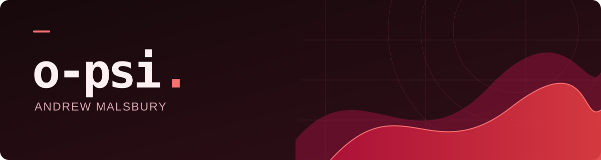

 

Managed Service Provider supporting **libre and open source software**.

 

## Right now: Voyage

My main project and the one I'm focused on right now.

### [helm.vessel.voyage ↗](https://github.com/o-psi/helm.vessel.voyage)

Helm terminal agent and Vessel management plane.

[Explore the project →](https://github.com/o-psi/helm.vessel.voyage#readme)

 

GitHub activity

 
<picture>
  <source media="(prefers-color-scheme: dark)" srcset="./profile/stats-dark.svg" />
  
</picture>

